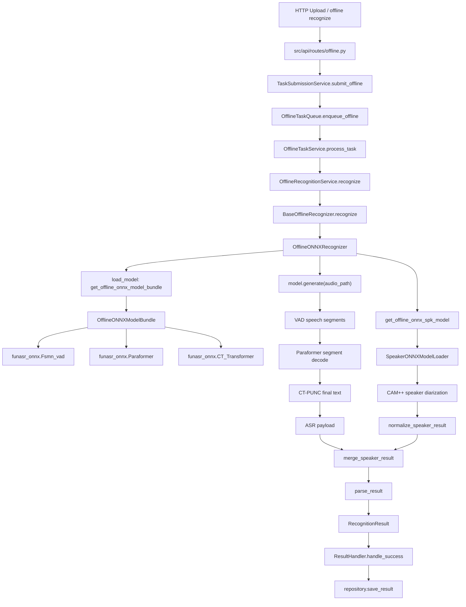

# Offline ONNX 调用链说明

本文说明当前项目中 OFFLINE ONNX 识别的完整流程：API 上传任务后，如何进入应用层，如何加载 `funasr_onnx` 三个 ONNX 模型，如何复用 SPK 引擎的 CAM++，以及最终如何把 ASR 结果和说话人结果合并为统一 `RecognitionResult`。

## 1. 当前定位

OFFLINE ONNX 不是一个 `funasr_onnx.AutoModel(asr + vad + punc + spk)` 组合模型。

本地 `funasr_onnx` 当前没有提供可直接组合 `ASR + VAD + PUNC + CAM++` 的 `AutoModel` 能力，所以项目采用显式组合：

```text
OFFLINE ONNX
  -> funasr_onnx.Fsmn_vad
  -> funasr_onnx.Paraformer
  -> funasr_onnx.CT_Transformer
  -> SPK 引擎 CAM++
  -> 合并 ASR 文本/时间戳/说话人片段
  -> RecognitionResult
```

对应核心文件：

1. API 入口：`src/api/routes/offline.py`
2. 应用服务：`src/application/offline.py`
3. Recognizer 模板：`src/engine_runtime/engines/offline/base.py`
4. ONNX Recognizer：`src/engine_runtime/engines/offline/onnx/recognizer.py`
5. 模型管理器：`src/engine_runtime/manager.py`
6. SPK ONNX loader：`src/engine_runtime/engines/spk/onnx/loader.py`
7. 说话人结果归一化：`src/engine_runtime/services/speaker/normalizers.py`

## 2. 总体调用链

从上传接口到识别完成，主链路是：

```text
HTTP Upload
  -> upload_offline_task()
  -> TaskSubmissionService.submit_offline(task_id)
  -> OfflineTaskQueue.enqueue_offline(task_id)
  -> queue worker
  -> OfflineTaskService.process_task(task_id)
  -> OfflineRecognitionService.recognize(audio_path)
  -> OfflineONNXRecognizer.recognize(request)
  -> OfflineONNXRecognizer.load_model()
  -> EngineModelManager.get_offline_onnx_model_bundle()
  -> OfflineONNXModelBundle(...)
  -> OfflineONNXRecognizer.run_inference(...)
  -> OfflineONNXModelBundle.generate(...)
  -> EngineModelManager.get_offline_onnx_spk_model()
  -> SPK CAM++ generate/callable
  -> normalize_speaker_result(...)
  -> OfflineONNXModelBundle.merge_speaker_result(...)
  -> OfflineONNXRecognizer.parse_result(...)
  -> ResultHandler.handle_success(...)
  -> repository.save_result(...)
```

其中 `OfflineONNXRecognizer.recognize(...)` 来自基类 `BaseOfflineRecognizer` 的统一模板。

## 3. 配置入口

文件：`config.yaml`

OFFLINE ONNX 使用 `engines.models.offline.onnx` 下的四个模型字段：

```yaml
engines:
  models:
    offline:
      enabled: onnx
      onnx:
        asr: "iic/speech_paraformer-large_asr_nat-zh-cn-16k-common-vocab8404-onnx"
        vad: "iic/speech_fsmn_vad_zh-cn-16k-common-onnx"
        punc: "iic/punc_ct-transformer_cn-en-common-vocab471067-large-onnx"
        spk: "iic/speech_campplus_speaker-diarization_common"
```

字段职责：

- `asr`：OFFLINE ONNX Paraformer 识别模型。
- `vad`：OFFLINE ONNX Fsmn VAD 分段模型。
- `punc`：OFFLINE ONNX CT-Transformer 标点模型。
- `spk`：CAM++ 说话人分割模型，由 SPK loader 加载，不放进 ONNX ASR bundle。

## 4. 模型加载链路

文件：`src/engine_runtime/manager.py`

OFFLINE ONNX 的模型加载入口是：

```python
EngineModelManager.get_offline_onnx_model_bundle()
```

它负责：

1. 从配置读取 `offline.onnx.asr/vad/punc`
2. 通过 `ModelDownloader.ensure_model(...)` 确保模型目录存在
3. 创建 `OfflineONNXModelBundle`
4. 缓存到 `_offline_onnx_model_bundle`

`OfflineONNXModelBundle` 内部实际加载：

```python
from funasr_onnx import CT_Transformer, Fsmn_vad, Paraformer
```

加载结果：

- `self.vad_model = Fsmn_vad(...)`
- `self.punc_model = CT_Transformer(...)`
- `self.asr_models = [Paraformer(...), ...]`

这里可以配置多个 ASR worker。多个 worker 是为了让 VAD 切出来的多个语音段可以并发识别，不表示底层模型天然是异步模型。

## 5. SPK/CAM++ 加载链路

文件：`src/engine_runtime/manager.py`

OFFLINE ONNX 的 CAM++ 获取入口是：

```python
EngineModelManager.get_offline_onnx_spk_model()
```

它负责：

1. 从配置读取 `offline.onnx.spk`
2. 调用 `SpeakerONNXModelLoader.load_model(...)`
3. 使用独立缓存键：`offline-onnx-spk:{spk_name}`

这点很重要：OFFLINE ONNX 的 ASR/VAD/PUNC bundle 不持有 SPK pipeline。  
说话人识别是作为独立能力被 recognizer 调用，然后再回到 offline ONNX bundle 做结果合并。

## 6. 推理执行链路

文件：`src/engine_runtime/engines/offline/onnx/recognizer.py`

`OfflineONNXRecognizer.run_inference(...)` 分两步：

```text
1. await asyncio.to_thread(model.generate, audio_path, hotwords, ...)
2. await self._recognize_speaker(audio_path, generate_kwargs)
3. model.merge_speaker_result(payload, speaker)
```

也就是说，ASR/VAD/PUNC 先跑，SPK 再跑，最后合并。

### 6.1 ASR/VAD/PUNC

`OfflineONNXModelBundle.generate(...)` 内部流程：

```text
audio_path
  -> librosa.load(audio_path, sr=16000)
  -> _detect_speech_segments(audio_data)
  -> vad_model(audio_data, kwargs=True)
  -> _run_asr_segments(audio_data, vad_segments, hotwords)
  -> Paraformer(segment_audio)
  -> _extract_timestamps(asr_result)
  -> CT_Transformer(raw_text)
  -> payload
```

返回的 payload 主要包含：

```python
{
    "text": final_text,
    "raw_text": raw_text,
    "vad_segments": vad_segments,
    "timestamps": timestamps,
    "asr_segments": asr_segments,
}
```

其中：

- `text` 是标点后的最终文本。
- `raw_text` 是 ASR 原始文本。
- `vad_segments` 是 VAD 语音段。
- `timestamps` 是合并后的 token 时间戳。
- `asr_segments` 是每个 VAD 段对应的识别结果。

### 6.2 SPK/CAM++

`OfflineONNXRecognizer._recognize_speaker(...)` 内部流程：

```text
audio_path
  -> EngineModelManager.get_offline_onnx_spk_model()
  -> model.generate(input=audio_path, ...)
     或 callable(model)(audio_path, ...)
  -> normalize_speaker_result(payload)
  -> SpeakerResult
```

如果 SPK 失败，当前策略是降级而不是让 ASR 整体失败：

```text
SPK 成功
  -> 合并 speaker segment

SPK 失败
  -> 保留 ASR 结果
  -> metadata.speaker_error 记录错误
```

## 7. ASR 与说话人结果合并

合并入口：

```python
OfflineONNXModelBundle.merge_speaker_result(payload, speaker)
```

合并优先级：

1. 优先使用 ASR token timestamp 与 speaker segment 对齐。
2. 如果 token timestamp 不可用，退回到 `asr_segments` 与 speaker segment 的时间重叠。
3. 如果 SPK 不可用或无 speaker segment，则只返回 ASR 自身的 `sentence_info`。

### 7.1 token timestamp 对齐

当 `payload["timestamps"]` 存在时：

```text
final_text + timestamps
  -> _align_text_to_timestamps(...)
  -> token 列表
  -> _speaker_for_time_range(token.start, token.end, speaker_segments)
  -> 相邻相同 speaker 的 token 合并成 sentence_info
```

适合场景：

- ASR 返回了较细粒度时间戳。
- 希望一句话中间换人时也能切开。

### 7.2 ASR segment 重叠兜底

当 token timestamp 不可用时：

```text
asr_segments
  -> _assign_speakers_to_asr_segments(...)
  -> 根据 segment.start/end 和 speaker.start/end 最大重叠选择 speaker
```

适合场景：

- 模型没有返回 token timestamp。
- 只能按 VAD/ASR 段粗粒度分配 speaker。

### 7.3 无 SPK 兜底

如果 `SpeakerResult.error` 存在，或没有 speaker segments：

```text
payload
  -> _build_asr_sentence_info(...)
  -> spk 默认 0
```

此时 `RecognitionResult.metadata["speaker_error"]` 会记录 SPK 错误。

## 8. parse_result 输出

`OfflineONNXRecognizer.parse_result(...)` 把合并后的 `sentence_info` 转为统一结果：

```python
RecognitionResult(
    mode="offline",
    full_text=payload["text"],
    segments=[
        Segment(
            text=sent["text"],
            start=sent["start"],
            end=sent["end"],
            speaker=sent["spk"],
            is_final=True,
            timestamp=sent["timestamp"],
        )
    ],
)
```

随后通过：

```python
normalize_recognition_result(result, mode="offline", is_final=True)
```

补齐统一字段，例如 speaker 汇总、最终状态等。

## 9. 和 OfflineCompositeService 的关系

`src/application/offline.py` 里还有 `OfflineCompositeService`，它可以把普通 offline ASR 结果和独立 speaker service 合并。

但当前 OFFLINE ONNX recognizer 自身已经完成：

```text
ASR/VAD/PUNC
  -> SPK CAM++
  -> merge_speaker_result
```

因此 OFFLINE ONNX 主路径不依赖 `OfflineCompositeService` 再做二次合并。  
`OfflineCompositeService` 更像是应用层可选组合能力，适合外部显式要求“ASR + speaker service”组合时使用。

## 10. 异步边界说明

当前 ONNX 路径里有两个 `asyncio.to_thread(...)`：

1. `model.generate(...)`
2. `spk_model.generate(...)` 或 callable SPK model

含义是：

- 底层推理函数仍然是同步阻塞调用。
- `to_thread(...)` 只是避免阻塞事件循环。
- 对单个任务来说，整体仍可理解为应用层串行编排。

简化理解：

```text
API/Scheduler/Application 是 async 编排
funasr_onnx 和 CAM++ 推理本体是同步计算
Recognizer 用 to_thread 把同步推理接入 async 服务链
```

## 11. Mermaid 流程图



## 12. 推荐阅读顺序

如果要理解当前 OFFLINE ONNX，建议按下面顺序读代码：

1. `src/api/routes/offline.py`
2. `src/scheduler/offline_scheduler.py`
3. `src/application/offline.py`
4. `src/engine_runtime/engines/offline/base.py`
5. `src/engine_runtime/manager.py`
6. `src/engine_runtime/engines/offline/onnx/recognizer.py`
7. `src/engine_runtime/engines/spk/onnx/loader.py`
8. `src/engine_runtime/services/speaker/normalizers.py`

这样最容易分清：

- 哪一层负责任务和业务编排。
- 哪一层负责模型加载。
- 哪一层负责真实推理。
- 哪一层负责 ASR/SPK 结果合并。

